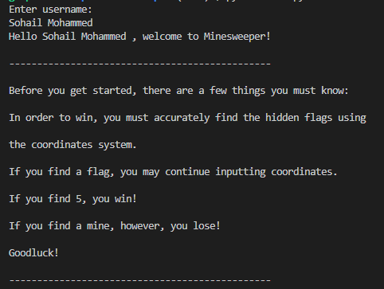
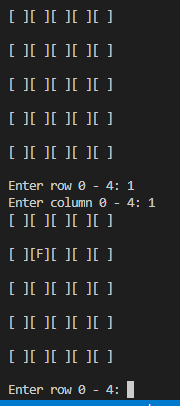
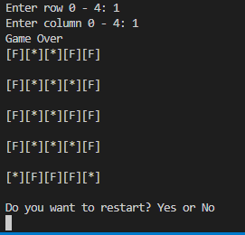
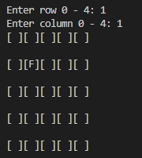
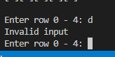

# **MineSweeper**

MineSweeper is a Python terminal project. This project runs in the Code Institute mock terminal provided by Heroku.

## **Rules of the game**
The aim of the game is to locate 5 flags located randomly on the grid. This is done using a coordinate system. If the user locates all 5 flags successfully, they will recieve a win message from the terminal. However, if the user inputs the coordinates for a mine, they lose. Once the game is over, users are given the option to restart. 

## **Features**

- Terminal prints out welcome message

-  

- User inputs row/ column. User is presented with a blank grid and prompted to enter rows and columns between 0-4. 

- 

- Reveal if user inputs data for mines

- 

- Continue prompt in case user finds flag 

- 

- Programme contains input validator

- 

## **Future Features**

- Allow players to play up to 3 games and reveal high score rankings
- Bigger grid and more empty spaces so user can uncover more areas

## **Data Model**

The data model for this project is the Minesweeper class. This class holds all of the information partaining to the board. As such, the Minesweeper class randomly inputs the flags and mines, masking, reveal and continuation prompt.  

The "if" loop contains the welcome prompt along with the username input and interger validator. This prevents the game from moving forward if the user inputs the wrong data. The "play_game" feature beneath helps users determine if they should restart or not. 

## **Testing**

I have manually tested this project via several methods:

- Inputted through PEP8 linter which gave no issues except for newline at the end of project. Although, this does not impact the project in anyway. 

- Invalid inputs were intentionally given to the programme and as such, the programme would not continue. 

## **Bugs**

Due to carelessness, I made the error of not commiting my project therefore some commits look drastically different to others. Due to this, I will give the report for commit "15/02" as well as the bugs I found during this project and what I fixed:

- Main problem was the function were not indented properly
- Functions were not taking self as first argument
- Decided to change the game so that win condition was to find 5 flags
- Figure out if user wins or not, create win/ lose condition and message depending on if user found mine or flag
- Got rid of empty space, board is now only flags/ mines
- Fixed incorrect input bug, told user if they put in invalid input
- 'try' keyword is to prove if user inputted wrong value
- Board will now expose itself if user finds mine

Bugs fixed by 06/07/2023:

- Users are now unable to input same coordinates twice
- Users are prompted to give appropriate responses at the end of the game
- Users are presented with a 'Game Over' message at the end of the game should they choose not to continue

## **Remaining Bugs**

- No remaining bugs 

## **Validator Testing**

- Use of PEP8
  - No errors were returned except for newline at end of project

## **Deployment**

This project was deployed via Code institutes mock terminal for Heroku

- Method of deployment
 - Fork/ clone repository
 - Create Heroku app
 - Set buildpacks to "Python" and "NodeJS" in that particular order
 - Link Heroku app to the repository
 - Click on "Deploy"

## **Credits**

- Code institute for deployment terminal
- Code institute project three example ReadMe file
- Stackoverflow for restart option
- ChatGPT, although the code was modified to fit project

